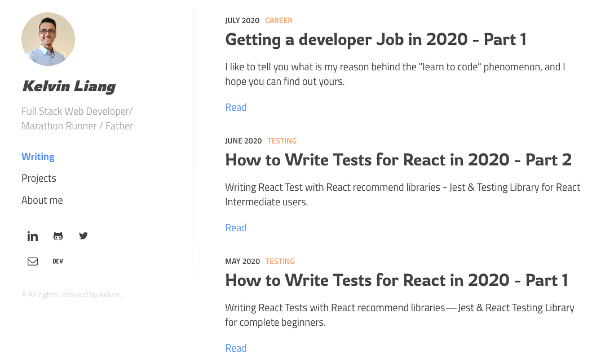

# My 2020 Portfolio Project

This is a stie built with [Gatsby.js](https://www.gatsbyjs.org/) using [gatsby-starter-lumen](https://github.com/alxshelepenok/gatsby-starter-lumen).

[](https://app.netlify.com/sites/kelvin-portfolio/deploys)

## Project ScreenShoot



## [Project Link](https://kelvinliang.cn)

## Add/modified Features

- Migrate to MDX support plugin
- Use google font
- Migrate flow to TypeScript
- Add TailwindCSS Support
- Add day.js (alternative of moment but smaller)
- Add Project page
- Update Post page UI

## To started:

```bash
yarn install
```

```bash
yarn develop
```
